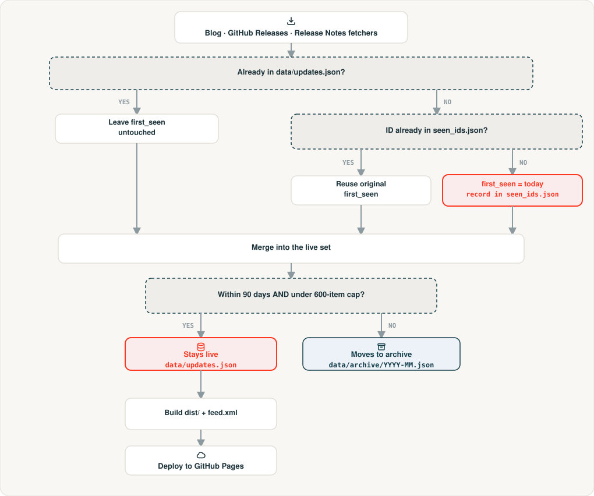
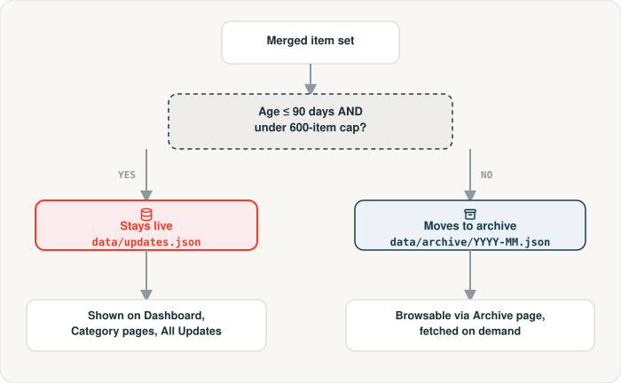
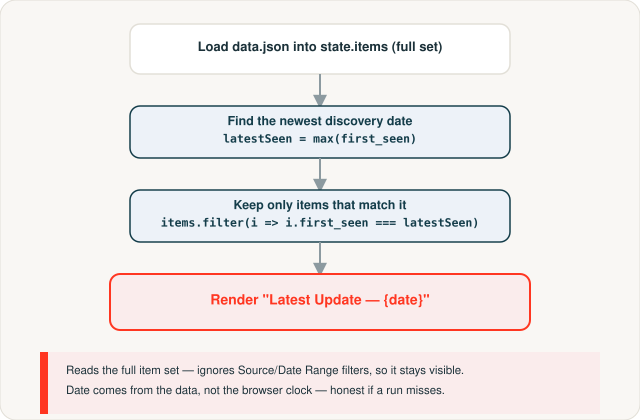

# Databricks Updates Feed

[](https://github.com/Harshaganesh23/databricks-updates-feed/actions/workflows/update.yml)

A daily-refreshed dashboard aggregating Databricks updates from official sources into one page.

- **Live dashboard:** https://harshaganesh23.github.io/databricks-updates-feed/
- **RSS feed:** https://harshaganesh23.github.io/databricks-updates-feed/feed.xml


## Sources

| Source | Method |
|---|---|
| Databricks Blog | Native RSS (`databricks.com/feed`), enriched with each post's real meta description |
| Databricks Release Notes | Parsed from the docs site's sidebar nav (no official RSS); recent months' pages are additionally fetched for real per-entry summaries |
| GitHub Releases | Public Atom feed per repo - a small hand-picked list (Spark, Delta, MLflow, Databricks SDK, CLI) plus every non-archived, non-fork repo auto-discovered under `databrickslabs` (see `config.yml`) |

Every item is classified into one of Databricks' own top-level product categories (AI Assistant, Application Development, Artificial Intelligence, Business Intelligence, Customer Data Platform, Database, Data Engineering, Data Warehousing, Governance, Security, Sharing, Platform Overview) by keyword matching - see `CATEGORIES` in `fetchers/common.py`.

## How it runs

A GitHub Actions workflow (`.github/workflows/update.yml`) runs daily:
1. Fetches all sources, merges new items into `data/updates.json`, deduped by URL. Items are categorized and their `first_seen` date is looked up in `data/seen_ids.json` - a permanent record of every item ID ever encountered, so a source re-fetching its full history (release notes fetch ~2000+ entries every run) never resets an old item's discovery date.
2. Anything outside the live retention window (see **Retention & archival** below) moves into `data/archive/`.
3. Builds the static dashboard + `feed.xml` into `dist/` (the archive is copied in too, so it's browsable via the site's Archive page).
4. Deploys `dist/` to GitHub Pages.

Each fetcher fails independently — if one source breaks, the others still update.



## Retention & archival

Controlled by `retention` in `config.yml`:
- **Live pages**: items stay for **90 days** (or until a generous 600-item safety cap, whichever binds first - age is meant to be the real constraint).
- **Archive**: anything older moves to `data/archive/YYYY-MM.json`, one file per month, committed to git permanently. **Nothing is ever deleted** - the site's Archive page (`#/archive`) lists every month and lets you browse it with the same UI as the live pages, fetched on demand so the live `data.json` payload stays small.

To change the window, edit `max_age_days`/`max_items` in `config.yml` - the archival logic itself doesn't need to change.



## The "Latest Update" block

The Dashboard's top section shows everything discovered in the most recent fetch run - the daily-skim view. It finds the newest `first_seen` date across the whole store and shows every item that shares it, reading from the full item set so narrowing the topbar's Source or Date Range filter never hides it, and labeling itself from that date rather than the browser's clock so it stays honest if a scheduled run doesn't fire.



## Local development

```bash
pip install -r requirements.txt
python fetch_all.py        # updates data/updates.json
python site/build.py       # builds dist/
```

Open `dist/index.html` in a browser (or serve it, since it fetches `data.json`/`archive/*.json` via `fetch()`):

```bash
python -m http.server --directory dist 8000
```

To reset local state and re-fetch everything from scratch: clear `data/updates.json` to `[]` (leave `data/seen_ids.json` and `data/archive/` alone unless you actually want to lose the discovery-date history and re-archive everything).

## Adding GitHub repos to watch

Edit the `github_releases.repos` list in `config.yml` — any public repo with GitHub Releases works, no token required.
